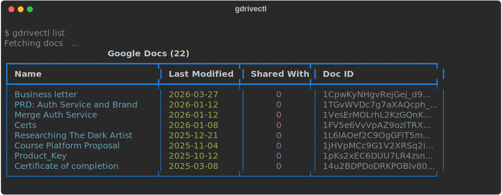

<div align="center">
  
  <h1>gdrivectl</h1>
  <p><strong>Manage Google Docs permissions in bulk from the command line.</strong></p>
  <p>
    <a href="https://pypi.org/project/gdrivectl"></a>
    <a href="https://aur.archlinux.org/packages/gdrivectl"></a>
    
    
    
  </p>
</div>

<br />

## Why gdrivectl?

Ever needed to clean up sharing permissions across dozens of Google Docs from old projects, college groups, or freelance work? The Drive UI makes you do it one file at a time. **gdrivectl** lets you audit, grant, and revoke permissions across all your docs in seconds — from the terminal.

---

## Table of Contents

- [Install](#install)
- [Quick Start](#quick-start)
- [Demo](#demo)
- [Features](#features)
- [Commands](#commands)
- [Safety](#safety)
- [How It Works](#how-it-works)
- [Tech Stack](#tech-stack)
- [gdrivectl vs Google Drive UI](#gdrivectl-vs-google-drive-ui)
- [Contributing](#contributing)
- [License](#license)

---

## Install

```bash
# PyPI (any platform)
pip install gdrivectl

# Arch Linux (AUR)
yay -S gdrivectl

# From source
pipx install git+https://github.com/TheDarkArtist/gdrivectl.git
```

## Quick Start

```bash
gdrivectl auth login             # one-time browser OAuth
gdrivectl list                   # show all your docs
gdrivectl revoke                 # dry-run
gdrivectl revoke --execute       # for real
```

OAuth credentials are bundled — no GCP project setup needed.

## Demo

<div align="center">
  
</div>

## Features

<table>
<tr>
<td width="50%">

**Bulk Operations**

Grant or revoke permissions across multiple docs in a single command. Interactive prompts let you pick docs, emails, and roles.

</td>
<td width="50%">

**Dry-Run by Default**

Every destructive command previews what it would do. Add `--execute` only when you're ready.

</td>
</tr>
<tr>
<td width="50%">

**Audit & Export**

Export all docs and their permissions to a timestamped CSV. Every grant/revoke operation is logged to JSON.

</td>
<td width="50%">

**Owner Protection**

Your email is auto-detected after login and excluded from all revoke operations. You can't accidentally lock yourself out.

</td>
</tr>
<tr>
<td width="50%">

**Interactive Prompts**

Fuzzy-searchable doc selection, role picker, email input, and confirmation — all from the terminal.

</td>
<td width="50%">

**Zero Config**

OAuth credentials are bundled. No GCP project, no API keys, no setup wizard. Just `pip install` and go.

</td>
</tr>
</table>

## Commands

| Command | Description |
|---|---|
| `gdrivectl auth login` | Authenticate with Google (opens browser) |
| `gdrivectl auth logout` | Remove stored credentials |
| `gdrivectl auth status` | Check authentication status |
| `gdrivectl list` | List all your Google Docs |
| `gdrivectl list --shared-only` | Show only shared docs |
| `gdrivectl inspect` | Inspect permissions on a specific doc |
| `gdrivectl grant` | Grant access (dry-run by default) |
| `gdrivectl grant --execute` | Grant access for real |
| `gdrivectl revoke` | Revoke access (dry-run by default) |
| `gdrivectl revoke --execute` | Revoke access for real |
| `gdrivectl audit` | Export all permissions to CSV |

## Safety

| Mechanism | Description |
|---|---|
| Dry-run default | `grant` and `revoke` preview changes unless `--execute` is passed |
| Owner protection | Your email is auto-detected and never shown as revocable |
| Confirmation prompts | Always asks before executing destructive changes |
| Audit logging | Every operation logs full results to `logs/` |
| Batch rate limiting | API calls are batched and rate-limited to avoid quota issues |

## How It Works

The bundled `credentials.json` is a public OAuth client ID that identifies the app to Google — this is standard practice for desktop/CLI tools (Google's own `gcloud`, `rclone`, and `youtube-dl` all do this). Running `gdrivectl auth login` opens your browser for Google's consent screen. Your access token is stored locally at `~/.config/gdrivectl/token.json` and never leaves your machine.

## Tech Stack

<p>
  
  
  
  
</p>

## gdrivectl vs Google Drive UI

| | gdrivectl | Google Drive UI |
|---|---|---|
| Bulk revoke across 50 docs | One command | 50 × click → share → remove → confirm |
| Audit all permissions to CSV | `gdrivectl audit` | Not possible without scripting |
| Dry-run before changes | Built in | Not available |
| Filter shared-only docs | `--shared-only` flag | Manual scrolling |
| Automation friendly | Fully scriptable | Browser only |
| Time for 50 docs | ~10 seconds | ~30 minutes |

## Contributing

```bash
git clone https://github.com/TheDarkArtist/gdrivectl.git
cd gdrivectl
python -m venv .venv && source .venv/bin/activate
pip install -e .
```

<details>
<summary><strong>Contributing Guidelines</strong></summary>

1. Fork the repo
2. Create a branch (`git checkout -b feature/my-thing`)
3. Make your changes
4. Test manually against your own Google Drive
5. Open a PR

See [CONTRIBUTING.md](CONTRIBUTING.md) for more details.

</details>

<details>
<summary><strong>Contributor Graph</strong></summary>
<p>
  <a href="https://github.com/TheDarkArtist/gdrivectl/graphs/contributors">
    
  </a>
</p>
</details>

## License

[MIT](LICENSE)

<br />

<div align="center">
  <sub>Built by <a href="https://thedarkartist.in">TheDarkArtist</a></sub>
</div>
